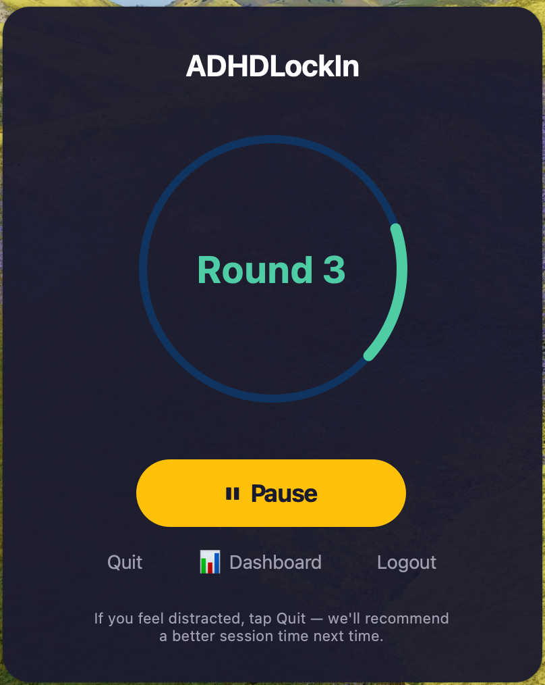
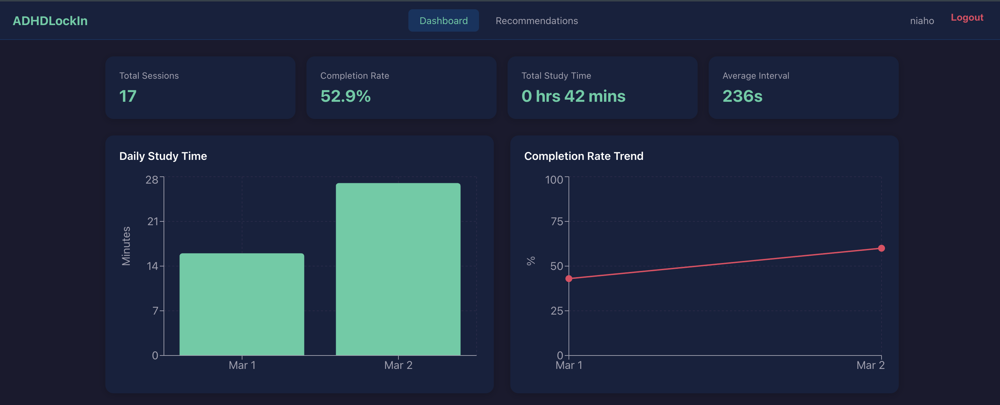
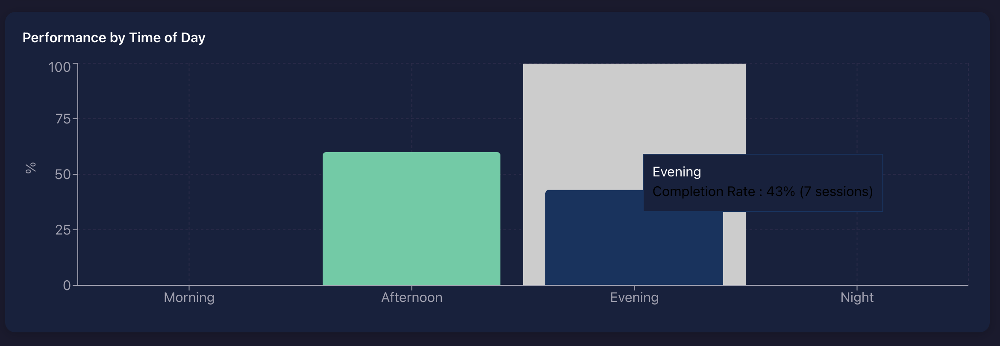
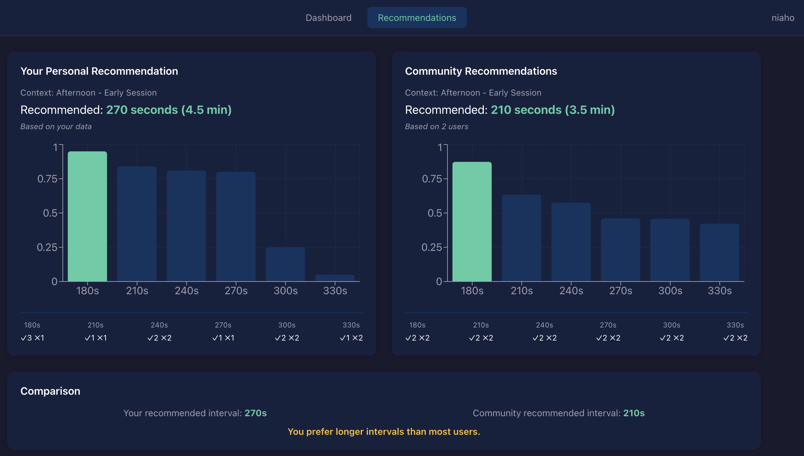
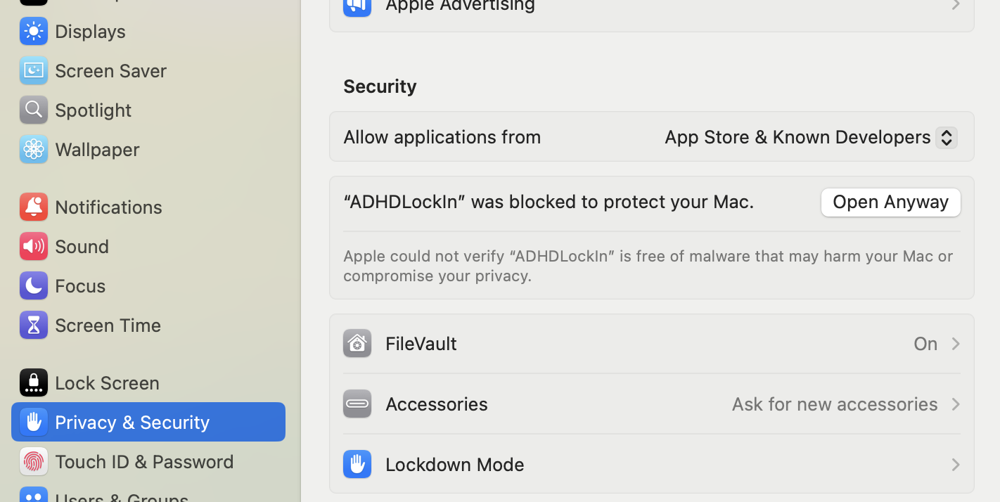

# ADHDLockIn

<p align="center">
  
</p>

**An adaptive focus timer for ADHD users that learns your optimal study intervals using machine learning.**

ADHDLockIn predicts your best focus duration based on time-of-day, session depth, and behavioral patterns — so you don't have to guess how long to study.

---

## How It Works

1. **Start a session** — the app picks an interval for you (e.g., 3 min, 4.5 min)
2. **Complete or quit** — if you finish, the algorithm records a success; if you quit early, it records a failure
3. **Get smarter over time** — a Thompson Sampling bandit algorithm learns which interval works best for you in each context
4. **View your data** — the React dashboard shows your study trends, completion rates, and personalized vs. community recommendations

---

## Screenshots

### Desktop App
The timer runs study rounds with adaptive intervals. Tap **Quit** if distracted — the algorithm adjusts next time.

<p align="center">
  
</p>

### Dashboard — Session Overview
Track total sessions, completion rate, daily study time, and average interval.



### Dashboard — Performance by Time of Day
See which part of the day you study best. This user completes 100% of evening sessions but only 60% in the afternoon.



### Dashboard — Personalized vs. Community Recommendations
Compare your optimal interval against what works for most users. The bar charts show Thompson Sampling scores across all 6 interval options.



---

## Architecture

| Layer | Technology | Purpose |
|-------|-----------|---------|
| Desktop App | Python, PyQt6 | Timer UI, session tracking, offline fallback |
| Frontend Dashboard | React, Recharts | Data visualization, recommendations |
| Backend API | Node.js, Express | 6 RESTful endpoints, cross-device sync |
| Database | PostgreSQL (AWS RDS) | Session logs, bandit parameters, user data |
| Cache | Redis | Low-latency bandit parameter reads (local dev) |
| ML Algorithm | Thompson Sampling | Contextual bandit with 6 arms × 12 contexts |
| Cloud Infrastructure | AWS Lambda, API Gateway, S3 | Serverless deployment via Terraform |
| Batch Pipeline | AWS EventBridge + Lambda | Nightly cross-user model retraining |

---

## ML Pipeline

| Stage | What Happens | When |
|-------|-------------|------|
| Data Collection | Each session logs duration, completion, time-of-day, session depth | Real-time (POST /api/sessions) |
| Parameter Update | Bandit alpha/beta updated per user per context | Real-time (on session completion) |
| Batch Aggregation | All users' bandit params aggregated across 12 contexts | Daily at 3 AM UTC (EventBridge → Lambda) |
| Population Recommendations | Pre-computed results stored in `population_recommendations` table | Written by batch job |
| Serving | Personal: live Thompson Sampling. Population: single SELECT query | Sub-100ms latency (hot start) |

### Bandit Algorithm Details

| Parameter | Value |
|-----------|-------|
| Arms (interval options) | 180s, 210s, 240s, 270s, 300s, 330s |
| Contexts | 4 time periods × 3 session depths = 12 |
| Time periods | Morning, Afternoon, Evening, Night |
| Session depths | Early (round 1-2), Mid (round 3-4), Deep (round 5+) |
| Prior | Beta(1, 1) — uniform, no bias |
| Update rule | Complete → alpha + 1, Quit → beta + 1 |

---

## API Endpoints

| Method | Endpoint | Description |
|--------|----------|-------------|
| POST | `/api/users/register` | Register new user, returns secret key |
| POST | `/api/users/login` | Authenticate with username + secret key |
| POST | `/api/sessions` | Log a completed or abandoned session |
| GET | `/api/sessions/:userId` | Fetch user's session history |
| GET | `/api/recommendations/:userId` | Personal interval recommendation |
| GET | `/api/recommendations/population` | Community recommendation (pre-computed) |

---

## AWS Deployment

Fully deployed with **Terraform** (infrastructure as code):

| Resource | Service | Notes |
|----------|---------|-------|
| Backend API | Lambda + API Gateway | Serverless, pay-per-invocation |
| Database | RDS PostgreSQL (db.t3.micro) | Private subnet, not publicly accessible |
| Dashboard | S3 Static Website | React build served as static files |
| Batch Job | Lambda + EventBridge | Scheduled daily at 3 AM UTC |
| DB Access | Bastion EC2 + SSM Tunnel | Secure RDS access without exposing ports |
| Security | Security Groups | Only Lambda and Bastion can reach RDS |
| Migration | Automated (migrate.js) | Tables created on first Lambda invocation |

---

## Installation (macOS)

### Download
1. Go to [Releases](https://github.com/Eriq7/ADHDLockIn/releases)
2. Download `ADHDLockIn-macOS.zip`
3. Unzip and move `ADHDLockIn.app` to your Applications folder

### First-Time Setup (Required)
macOS blocks unsigned apps by default. To open ADHDLockIn:

1. Double-click `ADHDLockIn.app` — you'll see a security warning, click **Done**
2. Open **System Settings → Privacy & Security**
3. Find *"ADHDLockIn" was blocked to protect your Mac* and click **Open Anyway**
4. Click **Open** in the confirmation dialog



You only need to do this once.

### Usage
1. Register with a username — save your secret key
2. Start studying — the app picks your interval automatically
3. Complete rounds or tap Quit if distracted
4. Click **Dashboard** to view your stats in the browser

---

## Tech Stack

| Category | Technologies |
|----------|-------------|
| Languages | Python, JavaScript, SQL |
| Desktop | PyQt6, PyInstaller |
| Frontend | React, Recharts, Axios |
| Backend | Node.js, Express, pg (node-postgres) |
| Database | PostgreSQL, Redis |
| ML | Thompson Sampling (Beta distribution), jstat |
| Cloud | AWS Lambda, API Gateway, RDS, S3, EventBridge |
| Infrastructure | Terraform, IAM, VPC, Security Groups |
| Tools | Postman, DBeaver, CloudWatch, Git |

---

## Project Structure

```
ADHDLockIn/
├── study_timer_gui.py      # Desktop app (PyQt6)
├── api_client.py            # API client for desktop
├── bandit.py                # Thompson Sampling algorithm
├── server/                  # Express backend
│   └── src/
│       ├── app.js           # Express app
│       ├── lambda.js        # Lambda entry point
│       ├── lambdaBatch.js   # Batch job Lambda entry
│       ├── batchJob.js      # Population aggregation logic
│       ├── migrate.js       # Database migration
│       ├── routes/          # API routes
│       ├── services/        # Business logic
│       └── config/          # DB connection
├── dashboard/               # React frontend
│   └── src/
│       ├── pages/           # Dashboard, Recommendations
│       └── components/      # Charts, stats cards
└── terraform/               # Infrastructure as code
    ├── main.tf
    ├── variables.tf
    └── outputs.tf
```

---

## License

MIT
